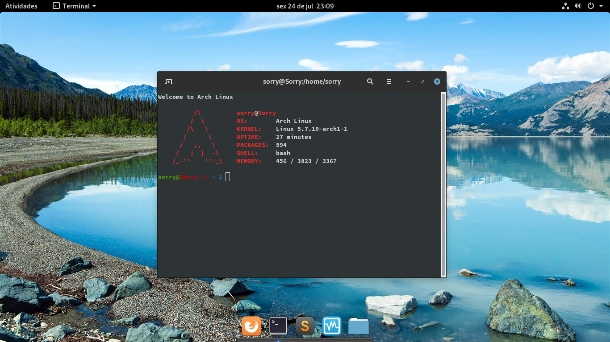

# **Aqua**

#### **Theme, icon, cursor and sound**

### **_Gnome_**

#### **_ArchLinux_**

[`Others`](OTHERS.md)

## **Installing Aqua**

#### **_Terminal open_**
> chmod +x install.sh

> ./install.sh

## **Change appearance with Gnome-Tweaks**

## **Change file folder icon**

> Open nano

> nano /usr/share/applications/org.gnome.Nautilus.desktop

> Change	Icon=org.gnome.Nautilus

> To		Icon=nautilus

## **Uninstalling Aqua**

#### **_Terminal open_**
> Change appearance with Gnome-Tweaks

> chmod +x uninstall.sh

> ./uninstall.sh

## **Change file folder icon**

> Open nano

> nano /usr/share/applications/org.gnome.Nautilus.desktop

> Change	Icon=nautilus

> To		Icon=org.gnome.Nautilus

## License
Distributed under the terms of the GNU General Public License, version 3. See the [`LICENSE`](LICENSE) file for details.
